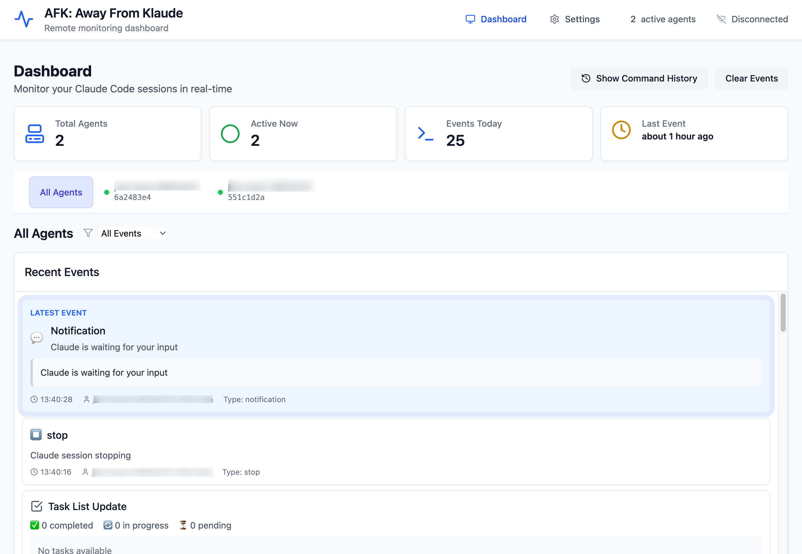

# AFK: Away From Klaude

**AFK: Away From Klaude** - A remote monitoring and control system for Claude Code sessions. The name is a playful take on "Away From Keyboard" - now you can go "Away From Klaude" while still maintaining full control over your AI development workflows from any device.



## 🚀 Quick Start

### For Self-Hosting

1. **Clone and install**:
   ```bash
   git clone https://github.com/joshystuart/claude-companion.git
   cd claude-companion
   npm install && npm run init
   ```

2. **Install the agent**:
This will add the necessary hooks to the `~/.claude/settings.json` file, allowing the agent to monitor and control your Claude Code sessions.

   ```bash
   npm run agent:install
   
   # Or you can call the agent directly
   afk-agent status
   # With the default server URL http://localhost:3000
   afk-agent install 
   # Or with a custom server URL
   afk-agent install --server-url http://localhost:4000
   ```
   
3. **Start the development servers**:
   ```bash
   # Run both the server and client in development mode
   npm start 
   ```

4. **Open the dashboard** at `http://localhost:3001`

5. Restart your Claude Code session to begin streaming events.

## 📋 Phase 1 Features

✅ **Core Monitoring (Available Now)**
- Real-time event streaming from Claude Code sessions
- Multi-agent support and coordination
- Mobile-responsive dashboard
- Event filtering and search
- Agent status tracking
- Basic authentication

🚧 **Coming in Phase 2**
- Remote approval/denial of tool calls
- Context injection mid-session
- Session control (pause/continue/redirect)
- Advanced automation and templates

## 🏗️ Architecture

### Three-Package Monorepo Structure
```
afk-away-from-klaude/
├── agent/          # NPM-installable hook installer
├── server/         # NestJS API server + real-time streaming
└── client/         # React dashboard for monitoring/control
```

### Communication Flow
1. **Agent → Server**: HTTP POST hook events to `/api/hooks/events`
2. **Server → Client**: Server-Sent Events on `/api/events/stream`
3. **Client → Server**: REST API for configuration and control

### Hook Integration
The agent installs lightweight shell commands in Claude Code's `~/.claude/settings.json`:

```json
{
  "hooks": {
    "pre_tool_use": "node /path/to/afk-agent/dist/hooks/pre-tool-use.js ...",
    "post_tool_use": "node /path/to/afk-agent/dist/hooks/post-tool-use.js ...",
    "stop": "node /path/to/afk-agent/dist/hooks/stop.js ...",
    "notification": "node /path/to/afk-agent/dist/hooks/notification.js ..."
  }
}
```

## 🛠️ Development

### Prerequisites
- Node.js 18+
- npm (or pnpm)

### Development Workflow

1. **Install dependencies**:
   ```bash
   npm install
   ```

2. **Build all packages**:
   ```bash
   npm run build
   ```

3. **Run in development mode**:
   ```bash
   # Start server (port 3000)
   npm run dev:server

   # Start client (port 3001)  
   npm run dev:client
   ```

4. **Install agent for testing**:
   ```bash
   cd agent
   npm link
   afk-agent install --server-url http://localhost:3000
   ```

5. **Test the integration**:
   - Open dashboard at `http://localhost:3001`
   - Run Claude Code commands
   - Watch events stream in real-time!

### Package Scripts

**Root Level**:
- `npm run build` - Build all packages
- `npm run dev` - Run all development servers
- `npm run test` - Run all tests
- `npm run lint` - Lint all packages

**Individual Packages**:
- `agent/`: CLI tool and hook commands
- `server/`: NestJS API server with SSE
- `client/`: React dashboard application

## 📖 Documentation

### Agent CLI Commands

```bash
# Install hooks
afk-agent install [options]

# Check installation status  
afk-agent status

# Uninstall hooks
afk-agent uninstall
```

**Options**:
- `--server-url <url>` - Server endpoint (default: http://localhost:3000)
- `--agent-id <id>` - Unique agent identifier (auto-generated)
- `--token <token>` - Authentication token (optional in Phase 1)

### API Endpoints

**Hook Events**:
- `POST /api/hooks/events` - Receive hook events from agents
- `POST /api/hooks/heartbeat` - Agent heartbeat

**Event Streaming**:
- `GET /api/events/stream` - Server-Sent Events stream
- `GET /api/events/agents` - Get agent list

**Authentication**:
- `POST /api/auth/agent/register` - Register agent
- `POST /api/auth/dashboard/token` - Get dashboard token
- `GET /api/auth/status` - Auth service status

### Configuration

**Environment Variables**:
```bash
# Server
PORT=3000
JWT_SECRET=your-secret-key
ALLOWED_ORIGINS=http://localhost:3001,http://localhost:5173

# Development
NODE_ENV=development
```

**Client Configuration**:
- Server URL: Configurable in dashboard settings
- Token: Optional for Phase 1, generated via API

## 🚀 Production Deployment

### Server Deployment

1. **Build the application**:
   ```bash
   npm run build
   ```

2. **Deploy server package**:
   ```bash
   cd server
   npm run start:prod
   ```

3. **Environment setup**:
   ```bash
   export PORT=3000
   export JWT_SECRET=your-production-secret
   export ALLOWED_ORIGINS=https://your-dashboard.com
   ```

### Client Deployment

1. **Build for production**:
   ```bash
   cd client
   npm run build
   ```

2. **Deploy static files**:
   - Upload `dist/` folder to your hosting provider
   - Configure server URL in dashboard settings

### Agent Distribution

1. **Publish to npm**:
   ```bash
   cd agent
   npm publish
   ```

2. **Global installation**:
   ```bash
   npm install -g afk-agent
   ```

## 🔒 Security

### Phase 1 Security Model
- Optional JWT-based authentication
- CORS protection for dashboard access
- Rate limiting on hook endpoints
- Input validation with DTOs

### Production Recommendations
- Use strong JWT secrets
- Enable HTTPS/TLS
- Configure proper CORS origins
- Implement rate limiting
- Monitor for abuse

## 📈 Performance

### Hook Performance Requirements
- **< 2 seconds execution time** (Claude Code requirement)
- Graceful error handling (always allow Claude to proceed)
- Automatic retry with exponential backoff
- Connection pooling and timeouts

### Scalability Considerations
- Event history limited to 500 events per client
- Automatic cleanup of stale agents (5+ minutes)
- Client connection management with auto-reconnection
- Memory-efficient event streaming

## 🤝 Contributing

1. **Fork the repository**
2. **Create feature branch**: `git checkout -b feature/amazing-feature`
3. **Make changes and test**: `npm run build && npm run test`
4. **Commit changes**: `git commit -m 'Add amazing feature'`
5. **Push to branch**: `git push origin feature/amazing-feature`
6. **Create Pull Request**

### Development Guidelines

- Follow existing code patterns and conventions
- Add TypeScript types for all new code
- Include tests for new functionality
- Update documentation as needed
- Ensure all builds pass before submitting

## 📄 License

MIT License - see [LICENSE](LICENSE) file for details.

## 🆘 Support

- **Issues**: [GitHub Issues](https://github.com/your-org/afk-away-from-klaude/issues)
- **Documentation**: This README and inline code comments
- **Community**: [Discussions](https://github.com/your-org/afk-away-from-klaude/discussions)

---

**This is Phase 1 - Monitoring Only**. Remote control features (approve/deny, context injection, session control) will be available in Phase 2.

Built with ❤️ for the Claude Code community. Go AFK without losing control!